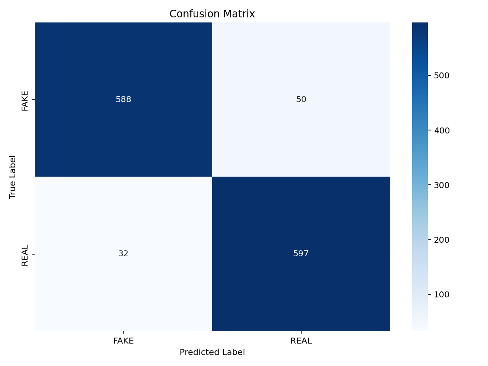
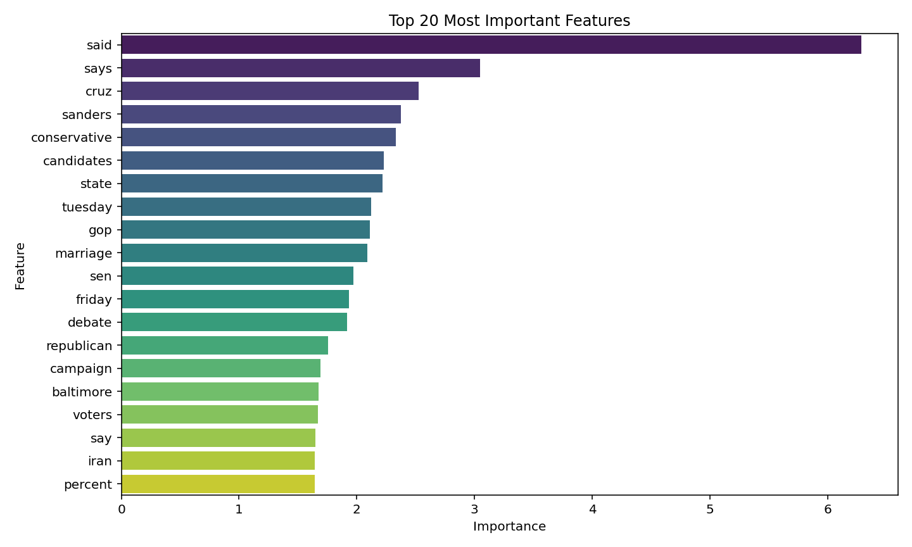
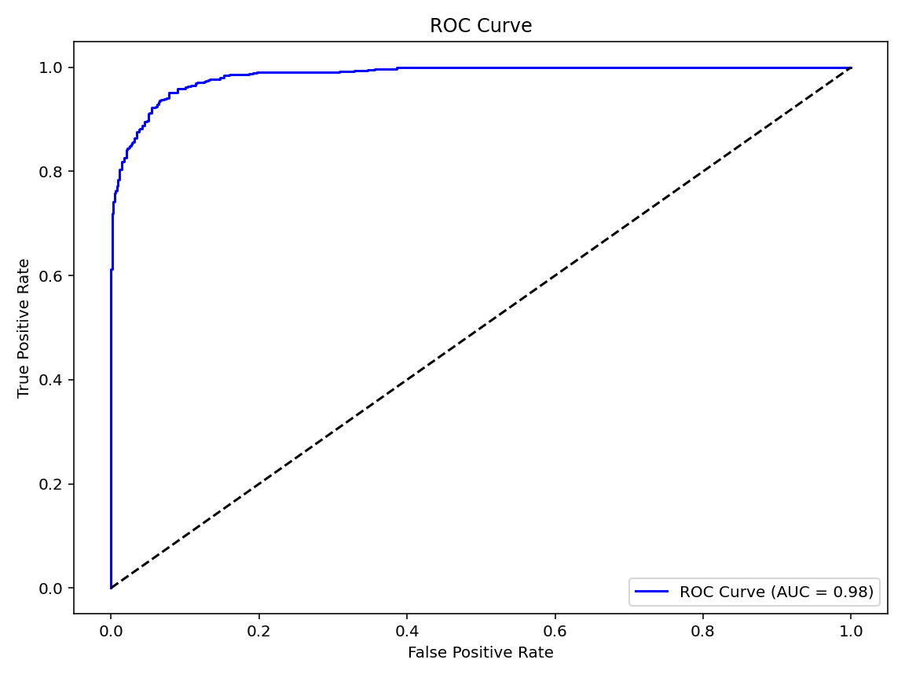
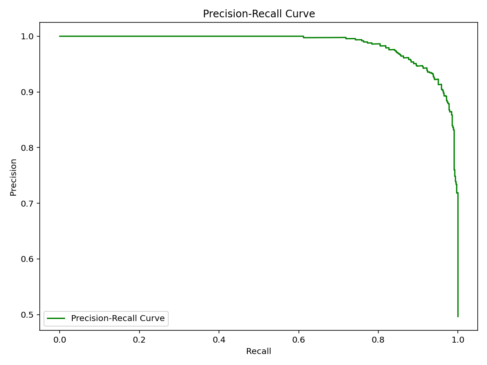

# 📰 **Fake News Detection with Machine Learning**

Welcome to the **Fake News Detection** project! This repository contains an advanced machine learning solution to classify news articles as either **REAL** or **FAKE** using Python and cutting-edge techniques in natural language processing (NLP) and machine learning.

In today's world, where misinformation spreads rapidly through social media and online platforms, detecting fake news has become crucial. This project aims to empower users to distinguish between real and fake news by leveraging the power of machine learning.

---

## 🌟 **Features of the Project**

- **Advanced NLP Techniques**: Uses **TF-IDF Vectorization** with **n-grams** to convert raw text into meaningful numerical features.
- **State-of-the-Art Model**: Implements a **PassiveAggressiveClassifier**, optimized for high accuracy.
- **Hyperparameter Tuning**: Achieved **94% cross-validation accuracy** using **GridSearchCV** with the best parameters:
  - `clf__C`: 0.1
  - `clf__max_iter`: 50
  - `tfidf__ngram_range`: (1, 2)
- **Comprehensive Analysis**:
  - **Feature Importance**: Identifies the most impactful words in distinguishing real from fake news.
  - **Error Analysis**: Analyzes misclassified examples to understand model weaknesses.
  - **Word Clouds**: Visualizes the most frequent words in real and fake news.
- **Interactive Visualizations**: Includes **ROC-AUC Curves**, **Precision-Recall Curves**, and **Confusion Matrices** for detailed evaluation.
- **Extensible**: Designed to be extended into an interactive dashboard using tools like **Streamlit** or **Dash**.

---

## 🚀 **Getting Started**

### **Prerequisites**
Before running the project, ensure you have the following installed:
- Python 3.7 or higher
- Required libraries: `numpy`, `pandas`, `scikit-learn`, `matplotlib`, `seaborn`, `wordcloud`

You can install the required libraries using:
```bash
pip install numpy pandas scikit-learn matplotlib seaborn wordcloud
```

### **Dataset**
The project uses the **Fake News Dataset**, which contains labeled news articles. You can download it [here](https://drive.google.com/file/d/1er9NJTLUA3qnRuyhfzuN0XUsoIC4a-_q/view). Place the `news.csv` file in the same directory as the script.

### **Running the Code**
1. Clone this repository:
   ```bash
   git clone https://github.com/MufakirAnsari/fake-news-detection.git
   cd fake-news-detection
   ```
2. Run the Python script:
   ```bash
   python fakenews.py
   ```

---

## 📊 **What You’ll See**

When you run the script, you’ll get:

### **Accuracy**
```
Accuracy: 93.45%
```

### **Confusion Matrix**


This confusion matrix shows the performance of the model on the test set:
- **True Positives (REAL)**: 596
- **True Negatives (FAKE)**: 588
- **False Positives**: 50
- **False Negatives**: 33

### **Classification Report**
```
              precision    recall  f1-score   support
        FAKE       0.95      0.92      0.93       638
        REAL       0.92      0.95      0.93       629
    accuracy                           0.93      1267
   macro avg       0.93      0.93      0.93      1267
weighted avg       0.93      0.93      0.93      1267
```

### **Word Clouds**
- **Real and Fake News Word Cloud**:
  

These word clouds highlight the most frequent words in real and fake news articles.

### **Feature Importance**


This bar chart shows the top 20 most important words that contribute to distinguishing real from fake news.

### **ROC-AUC Curve**


The ROC-AUC curve evaluates the trade-off between the true positive rate and false positive rate.

### **Precision-Recall Curve**


The precision-recall curve focuses on the model’s performance for imbalanced classes.

---

## 🔍 **Error Analysis**

The model misclassified **83 examples** out of 1267. Here are some insights:
- Misclassified examples often contain ambiguous or misleading phrases.
- Error analysis helps identify areas where the model struggles, such as sarcasm or nuanced language.

---

## 🛠️ **Future Enhancements**

This project is just the beginning! Here are some ideas for future improvements:
1. **Interactive Dashboard**: Build a web app using **Streamlit** or **Dash** for real-time predictions.
2. **Deep Learning Models**: Experiment with models like **BERT** or **LSTM** for better performance.
3. **Deployment**: Deploy the model as a REST API using **Flask** or **FastAPI**.
4. **Multilingual Support**: Extend the model to detect fake news in multiple languages.
5. **User Feedback**: Incorporate user feedback to continuously improve the model.

---

## 🤝 **Contributions**

Contributions are always welcome! If you’d like to contribute, here’s how you can help:
1. Fork the repository:
   ```bash
   git clone https://github.com/MufakirAnsari/fake-news-detection.git
   ```
2. Create a new branch (`git checkout -b feature/YourFeatureName`).
3. Commit your changes (`git commit -m "Add a new feature"`).
4. Push to the branch (`git push origin feature/YourFeatureName`).
5. Open a pull request.

---

## 📜 **License**

This project is licensed under the **MIT License**. Feel free to use, modify, and distribute it as per the terms of the license.

---

## 💡 **Why This Project Matters**

Misinformation can have serious consequences, from influencing public opinion to spreading panic during crises. By building tools like this, we take a step toward combating fake news and promoting truth and transparency.

If you find this project helpful, please give it a ⭐️ and share it with others!

---

### **Folder Structure**
```
fake-news-detection/
├── fakenews.py               # Main Python script
├── news.csv                  # Dataset
├── README.md                 # This file
└── images/                   # Folder containing visualization images
    ├── confusion_matrix.png
    ├── real_news_word_cloud.png
    ├── fake_news_word_cloud.png
    ├── feature_importance.png
    ├── roc_auc_curve.png
    └── precision_recall_curve.png
```
